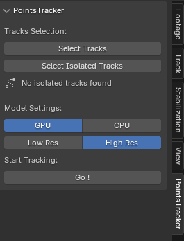

**PointsTracker** is a Blender add-on that leverages AI-powered models to effortlessly track points in your videos. Designed with user-friendliness in mind, it eliminates the need for tracking markers and manual tracking, providing a seamless tracking experience through advanced AI technology.

## Installation ⚙️

1. **Download the Add-on:**
   - Get the [latest release](https://github.com/btroussel/points-tracker/releases/latest).

2. **Install in Blender:**
   - Open Blender.
   - Go to `Edit` > `Preferences` > `Add-ons`.
   - Click on `Install...`, navigate to the downloaded ZIP file, and select it.
   - Enable the add-on by checking the box next to **PointsTracker**.

3. **Activate:**
   - Once installed, PointsTracker is ready to use. Refer to the [Usage](#usage) section to get started.

## Usage 💻

Follow these steps to start tracking points with PointsTracker:

1. **Place Markers:**
   - In your video sequence, press `Ctrl + Left Click` to place markers over the points you want to track.

2. **Select Markers:**
   - Choose the markers you wish to track. You can `Select Tracks` or `Select Isolated Tracks`.

   

3. **Configure Settings:**
   - Select your preferred processing mode (`GPU` or `CPU`).
   - Choose the desired tracking resolution (`Low Res` or `High Res`) based on your project's requirements.

4. **Start Tracking:**
   - Click the `Go !` button to initiate the tracking process.

5. **Visualize Tracking:**
   - Monitor the tracking progress in real-time with the live visualization feature and enjoy your accurately tracked markers.

**Note:**  
If you find the tracking accuracy insufficient, press `Escape` or `Right Click` to stop the process. Then, try again with different markers or adjust the settings for better results.

Here is the side panel of the addon as a reference : 

## Compatibility 💻

- **GPU Support:**
  - PointsTracker is optimized for CUDA GPUs with **4GB of VRAM** or more for optimal performance.

- **CPU Support:**
  - The add-on can operate on CPU, but performance may be significantly slower compared to GPU acceleration.

- **Apple Silicon:**
  - Compatibility with Apple Silicon GPUs has not been tested. 

**Having Issues?**  
If you encounter problems with a supported GPU, please [create an issue](https://github.com/btroussel/points-tracker/issues) on our GitHub repository for assistance.

## Contributing 🤝

We welcome contributions from the community! Whether you're looking to add new features, improve existing ones, or provide feedback, your input is invaluable.

- **Report Issues:**  
  Visit the [Issues Page](https://github.com/btroussel/points-tracker/issues) to report bugs or suggest enhancements.

- **Submit Pull Requests:**  
  Fork the repository and submit your changes for review.

- **Feature Requests:**  
  Share your ideas for new features or improvements on the Issues Page.

## Acknowledgments 🙏

PointsTracker utilizes the [TAPIR: Tracking Any Point with Per-frame Initialization and Temporal Refinement](https://deepmind-tapir.github.io/) model developed by Google DeepMind. TAPIR provides robust capabilities for tracking points across video frames, enabling the powerful features of this add-on.

*Please note that PointsTracker is not affiliated with or endorsed by Google DeepMind.*

